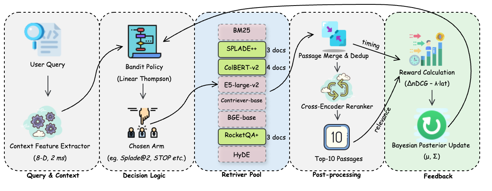

# Bandit‑Quota (6‑arm) — BEIR datasets (all 13 datasets)

A lightweight **contextual‑bandit retrieval** demo that combines six off‑the‑shelf dense encoders with a latency‑aware Thompson‑sampling policy.




The pipeline reproduces the headline results reported in our CIKM 2025 resource‑track submission (for SciFact dataset):

```
Bandit    nDCG@10 ≈ 0.704   mean latency ≈ 0.91 s/query
Union‑6   nDCG@10 ≈ 0.606   mean latency ≈ 0.99 s/query
Best single encoder (bge)  nDCG@10 ≈ 0.7149   mean latency ≈ 6.97 s/query
```
For the NFcorpus dataset
```
Bandit    nDCG@10 ≈ 0.3523   mean latency ≈ 0.694 s/query
Union‑6   nDCG@10 ≈ 0.2441   mean latency ≈ 4.079 s/query
Best single encoder (bge)  nDCG@10 ≈ 0.3338   mean latency ≈ 0.570 s/query
```

Everything lives in a single, self‑contained script — **`scripts/bandit_quota_artifact.py`** — that you can run on any CPU‑only machine with ≥16 GB RAM.

---

## Requirements

* Python 3.9 – 3.12
* `pip install -r requirements.txt` (≈ 900 MB once all HF models are cached)
* **No GPU needed** — the reranker and encoders run comfortably on a modern laptop.

> **Tip:** first run with `TRANSFORMERS_OFFLINE=1` if you have already cached the models elsewhere.

---

## Quick‑start

```bash
# 1) clone and enter
$ git clone [https://github.com/your‑name/bandit‑quota](https://github.com/skcpda/bandit-quota)
$ cd bandit‑quota

# 2) (optional) create virtual‑env
$ python -m venv .venv && source .venv/bin/activate
$ cd bandit-quota
$ pip install -r requirements.txt

# 3) run the artifact script
$ python scripts/bandit_quota_artifact.py
```

The script automatically downloads the **BEIR SciFact** test split (\~9 MB) on first launch, produces per‑arm baselines, the naïve union run, and the Bandit‑Quota scores.

Expected terminal tail:

```
=== SciFact test (300 queries) ===
Bandit    nDCG@10 0.7043   mean lat 0.907s
Union‑6   nDCG@10 0.4908   mean lat 6.970s
...
```

---

## Repository layout (minimal)

```
├── scripts/
│   └── bandit_quota_artifact.py   ← the only executable
├── LICENSE                        ← MIT
├── README.md                      ← you are here
└── requirements.txt               ← pinned deps (BEIR v2, Sentence‑Transformers ≥ 2.5)
```
---


# Any other BEIR dataset – e.g. NFCorpus or TREC-COVID
* `python scripts/bandit_quota.py --dataset nfcorpus`
* `python scripts/bandit_quota.py --dataset trec-covid`


Here is full list of BEIR datasets, all are supported by bandit-quota custom retriver:
* TREC-COVID (COVID-19 literature)
* NFCorpus (natural facts)
* SciFact (scientific claim verification)
* SCIDOCS (scientific document retrieval)
* FEVER (fact verification)
* Climate-FEVER (climate change verification)
* HotpotQA (multi-hop QA)
* NaturalQuestions (open-domain QA)
* FiQA-2018 (financial QA)
* ArguAna (argument retrieval)
* CQADupStack (forum question duplication) – treated as separate sub-sets (AskUbuntu, SuperUser, ServerFault, Webmasters, etc.)
* DBPedia (entity retrieval)
* TREC-NEWS (news article retrieval)
---

## Citation

If you build on this work, please cite the resource paper: (To be updated soon)

---

## License

Released under the MIT License — see the `LICENSE` file for full text.
